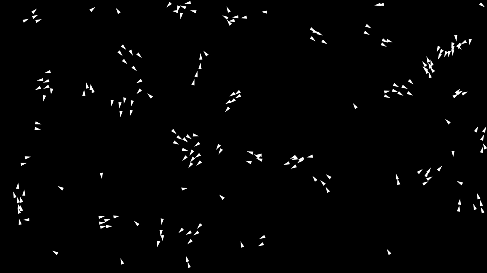
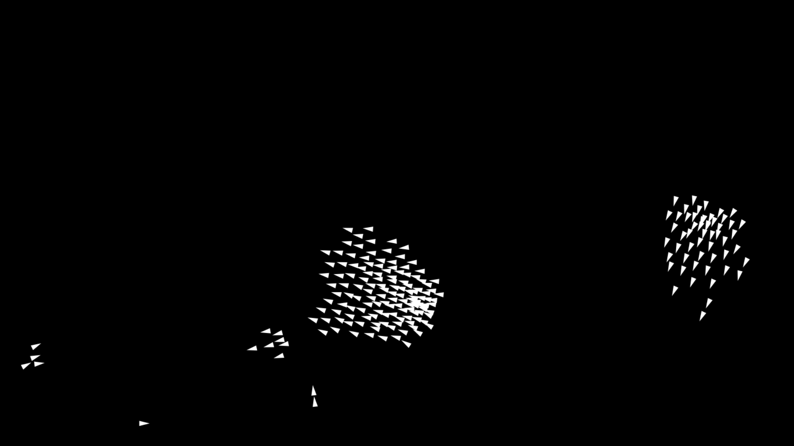
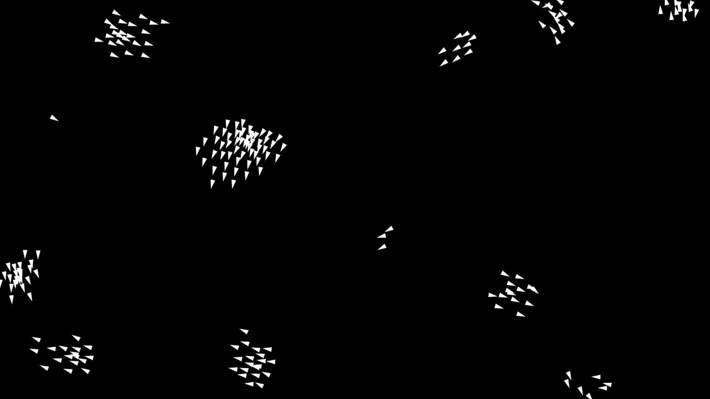

# Boids Flocking Simulation

A simple flocking simulation inspired by Craig Reynolds' **Boids Algorithm**.

Built using only **HTML, CSS, and JavaScript**.

The simulation models emergent flocking behavior where multiple agents move collectively using a small set of behavioral rules.

---

# ✨ Features

- Pure HTML, CSS, and JavaScript
- Real-time flocking simulation
- Autonomous boid agents
- Alignment, cohesion, and separation behaviors
- Boundary collision handling
- Lightweight and dependency-free
- HTML5 Canvas rendering

---

# 🧠 About Boids

Boids are autonomous agents that simulate natural flocking behavior observed in birds, fish schools, and swarms.

Each boid follows three simple rules:

- **Alignment** → move in the same direction as nearby boids
- **Cohesion** → move toward nearby boids
- **Separation** → avoid crowding nearby boids

Although the rules are simple individually, they collectively produce complex and natural-looking group movement.

---

# 🧠 Technical Overview

The simulation is rendered using the HTML5 Canvas API and powered entirely by vanilla JavaScript.

The implementation includes:

- `requestAnimationFrame` animation loop
- Custom vector math system
- Real-time flocking behavior calculations
- Spatial distance checks
- Velocity and steering force limiting
- Boundary collision handling
- Canvas-based rendering

The boids continuously update their movement based on neighboring agents within configurable viewing ranges.

---

# ⚙️ Simulation Parameters

The simulation includes adjustable values such as:

- Boid count
- Maximum speed
- Maximum steering force
- View radius
- Separation radius
- Wall padding

These parameters affect the overall flocking behavior and movement dynamics.

---

# ⚡ Optimization Notes

The implementation includes several lightweight optimizations for smoother real-time performance:

- Reduced temporary object creation
- Squared-distance comparisons
- Custom vector utility class
- Shared animation loop
- Limited steering calculations

---

# 🌐 Live Demo

```txt

```

---

# 📸 Preview







---

# 📁 Project Structure

```bash
Boids-Flocking-Simulation/
│
├── index.html
├── style.css
├── script.js
├── README.md
│
└── Resources/
    ├── img0.png
    ├── img1.png
    └── img2.png
```

---

# 🚀 Run Locally

## Option 1 — Open Directly

Open `index.html` in your browser.

---

## Option 2 — VS Code Live Server

1. Install the **Live Server** extension
2. Right-click `index.html`
3. Click **Open with Live Server**

---

# 🛠️ Built With

- HTML5
- CSS3
- Vanilla JavaScript
- HTML5 Canvas API

---

# 💡 Inspiration

Inspired by:

- Craig Reynolds' Boids Algorithm
- Emergent behavior simulations
- Collective motion systems found in nature

---

# 👨‍💻 Author

### Herry Patel
